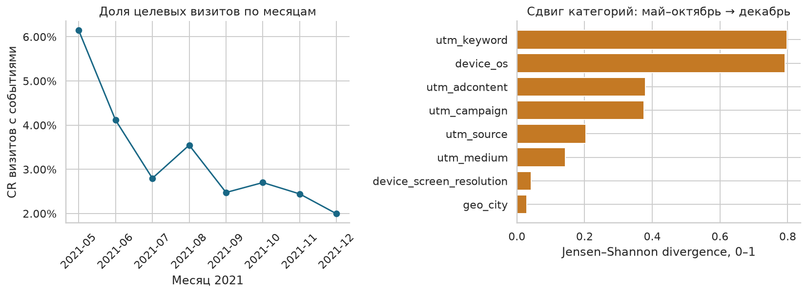

# СберАвтоподписка: прогноз целевого действия

Проект машинного обучения для оценки вероятности целевого действия посетителя сайта по источнику трафика, устройству и географии. Включает подготовку событий веб-аналитики, исследование данных, временную проверку моделей и REST API на FastAPI.

**Стек:** Python · pandas · scikit-learn · CatBoost · FastAPI · Pydantic · Jupyter.

## Результат

Обучение: май–октябрь 2021. Подбор модели и порога: ноябрь. Тест: декабрь, **366 245 визитов**. По ноябрьскому ROC-AUC выбран CatBoost с умеренными весами классов.

| Метрика на декабре | Значение |
|---|---:|
| ROC-AUC | 0,5821 |
| Average Precision | 0,0314 |
| Precision | 3,49% |
| Recall | 12,84% |
| Доля целевых визитов | 1,99% |

Основной порог — 0,0458, выбран по максимуму F1 на ноябре. Ориентир ROC-AUC 0,65 не достигнут: модель ограниченно переносится на следующий месяц. Взвешенная модель лидирует на validation, но не на test; выбор по тесту не меняется. Подробности — в [результатах](RESULTS.md) и [ноутбуке](analysis.ipynb).



## Методика

- Одна строка — визит. Цель равна 1, если есть хотя бы одно из восьми событий обращения или интереса; это не подтверждённая продажа. Список событий находится в `prepare.py`.
- События читаются блоками и объединяются с визитами по `session_id`. Визиты без событий исключаются из обучения: результат наблюдения для них неизвестен.
- Используются 12 категориальных и 8 производных признаков. ID, даты, события и статистики будущих визитов не входят в модель. `device_model` почти полностью пуст и исключён.
- RandomizedSearchCV проверяет 6 комбинаций на 250 000 обучающих и 80 000 ноябрьских строках. `PredefinedSplit` сохраняет хронологию; `refit=False`. Лучшие параметры затем обучаются на полном train.
- Сравниваются логистическая регрессия, базовый CatBoost и три режима весов найденной конфигурации: 1, sqrt(N0/N1), N0/N1. Веса вычисляются только на train.
- Модель, веса и порог выбираются по ноябрю. Выбор и контрольная сумма модели фиксируются до декабрьской оценки. Возвращающиеся клиенты допускаются; новые клиенты проверяются отдельным срезом.
- Оцениваются ROC-AUC, AP, precision, recall, F1, Brier, калибровка, недельные срезы и изменение распределений. Поправка на веса применяется одинаково при оценке и в API; она не гарантирует калибровку.

## Структура

```text
analysis.ipynb        # Выполненный анализ с графиками и выводами
analysis.html         # Отчёт для просмотра в браузере
prepare.py            # Подготовка данных и целевой переменной
features.py           # Единая обработка признаков
train.py              # Обучение, поиск параметров и оценка
predict.py            # Загрузка модели и CLI
app.py, schema.py     # FastAPI и валидация запросов
artifacts/            # Готовая модель и метаданные
reports/              # Метрики, таблицы, графики и проверки
examples/             # Примеры JSON-запросов
test_*.py             # Проверки методики и сервиса
```

## Быстрый запуск

Python 3.12. Выполните из корня проекта:

```sh
python3.12 -m venv .venv
source .venv/bin/activate
python -m pip install -r requirements.txt
python predict.py --input examples/session.json
python -m uvicorn app:app --host 127.0.0.1 --port 8035
```

Windows: `.venv\Scripts\activate` вместо `source`. Для запуска готовой модели исходные CSV не нужны. В репозитории модель хранится в `artifacts/model.cbm.gz`; сервис распаковывает её во временный файл при загрузке, поэтому после старта обычный прогноз работает без дополнительных действий.

Интерфейс: <http://127.0.0.1:8035/>. Документация API: <http://127.0.0.1:8035/docs>.

```sh
curl -X POST http://127.0.0.1:8035/predict \
  -H 'Content-Type: application/json' \
  --data-binary @examples/session.json
```

| Маршрут | Результат |
|---|---|
| `GET /health` | Статус и имя модели |
| `POST /predict` | Число 0 или 1 |
| `POST /predict_proba` | Класс, оценка вероятности и порог |
| `POST /predict_batch` | Классы для `{"sessions": [{...}, {...}]}`, до 1000 визитов |

Принимаются 13 строковых полей `utm_*`, `device_*`, `geo_*` из `schema.py`. Пропуски и неизвестные категории допустимы; хотя бы одно используемое поле должно быть заполнено. Лишние поля, неверные типы, пустой запрос и строки длиннее 512 символов возвращают 422. Модель загружается один раз на процесс, CatBoost использует один поток на запрос. Тела запросов не сохраняются.

## Данные и воспроизведение

Источник — учебный набор «СберАвтоподписка» (Skillbox), **19.05–31.12.2021**: 1 860 042 визита и 15 726 470 событий. Контрольные суммы входов сохранены в `reports/source_manifest.json`. Исходные данные не включены в репозиторий; для полного воспроизведения нужна их локальная копия.

Папка данных должна содержать:

```text
ga_hits-002.csv
skillbox_diploma_main_dataset_sberautopodpiska/
└── ga_sessions.csv
```

```sh
python prepare.py --data-dir /путь/к/данным --force
python train.py --force
```

По умолчанию `prepare.py` ищет данные в родительской папке проекта. После подготовки обучение использует локальный кэш. Обычный `python train.py` читает сохранённые результаты; `--force` выполняет обучение заново. При изменении данных или кода кэш нужно обновить явно.

Откройте `analysis.ipynb` из корня проекта. Для EDA нужен кэш подготовки или исходные CSV; для полного перерасчёта установите `REBUILD_DATA=True` и `RETRAIN=True`. Сохранённые результаты доступны и без запуска. Подготовленные таблицы, промежуточные модели и окружение исключены из Git через `.gitignore`.

## Проверка

```sh
python -m unittest test_temporal test_service -v
python verify_results.py
# При запущенном API:
python benchmark.py --url http://127.0.0.1:8035
```

13 тестов покрывают временные границы, допустимые признаки, поиск настроек, веса, пороги, входы API и совпадение обучения с прогнозами сервиса. Тест совпадения пропускается, если отсутствуют локальные `sessions_labeled.parquet` и `test_predictions.parquet`; они создаются подготовкой и обучением. `verify_results.py` также требует обе таблицы и независимо сверяет состав теста, метки, ранговую формулу ROC-AUC и контрольную сумму модели.

Замер 100 последовательных и 100 параллельных запросов: средняя последовательная задержка **5,6 мс**. Это локальный HTTP после загрузки модели, без холодного старта и внешней сети; детали в `reports/api_benchmark.json`.

## Ограничения

Ретроспективная проверка на историческом наборе не заменяет проспективную оценку на следующих периодах. Одна временная граница и шесть конфигураций не доказывают оптимальность модели. Исключение визитов без событий может создавать смещение отбора. Для рабочего порога нужны стоимость ошибок и допустимое число обращений. Качество на данных после 2021 года не установлено.
